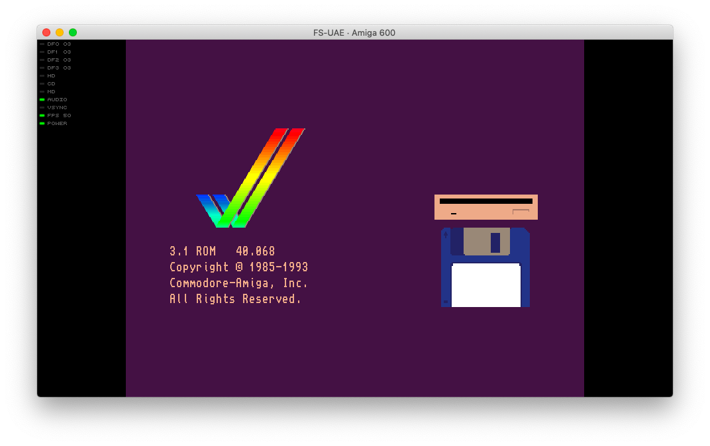

# Blinken

Simple theme for [FS-UAE](https://fs-uae.net/), based on [led-bars-edge](https://github.com/FrodeSolheim/fs-uae/tree/master/share/fs-uae/led-bars-edge).

## Install

Copy the `blinken` or `blinken flat` folder to the FS-UAE `Themes` folder.

Add `theme = (theme name)` to the desired FS-UAE configuration file.

* If you don't want the 'off' leds (or others) to show, rename or delete them.
